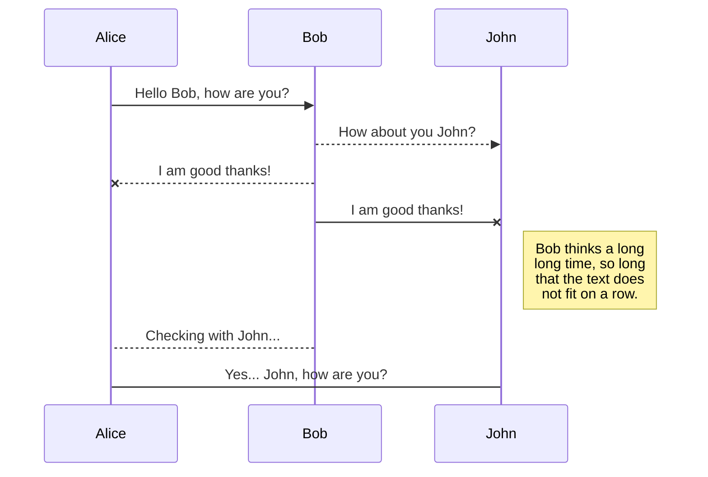
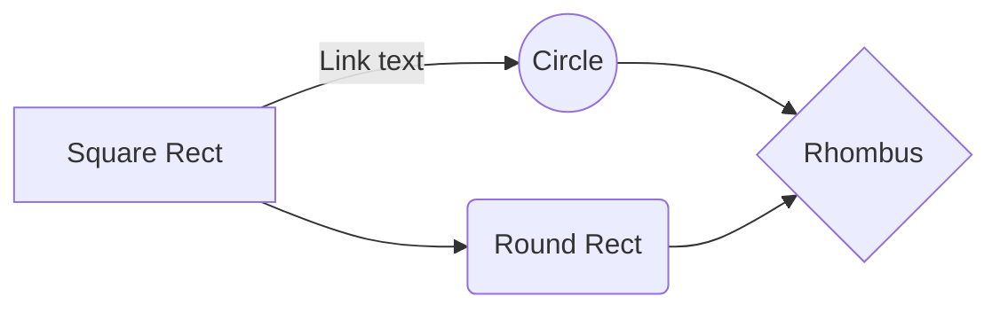

# 중대숲(JCommunity)

중대숲은 **중대 내 소통 플랫폼** 입니다.  

스마트폰 사용허가에 따라 용사들 간의 소통은 대부분 온라인을 기반으로 이루어지게 되었습니다. 이에 현재 많은 부대에서 시행되고 있는 **마음의 편지**,  **건의사항 설문**,  **공지사항** 등의 소통방식을 온라인 서비스로 구현했습니다. 

중대숲에선
> *아무에게도 들킬 염려가 없는*  **마음의 편지** 
*댓글과 좋아요를 통해 다른병사들의 피드백을 받아볼 수 있는* **건의사항**    
*가장 핫한 건의사항과 최신 공지사항, 실시간 부대 정보를 한눈에 볼 수 있는* **대시보드**
*병사와 당직 사관 모두가 불편했던 기존 전화방식보고에서 탈피한* **복귀보고체계**
*지금 다른 중대원들이 어디까지 복귀했는지 확인가능한* **중대원 복귀 현황**
>
등의 서비스를 이용할 수 있습니다.
앞으로도 발전할 중대숲을 기대해 주세요!!

## 일반 현황
 - 2019 국방부오픈소스아카데미 공개SW 집체교육 WEB분야 산출물
 - 인원 : 교육사령부 육군상병 김장영 (API & web서버,  Vue기반 SPA)
 - 개발 기간 : '19.10.21 ~ '19.10.25

## 컴퓨터 구성 / 필수 조건 안내 (Prerequisites)

### 컴퓨터 환경
 - Node.js가 설치되어 있어야 합니다.
 - 인터넷 접속이 필요합니다(지도 API 사용)
 - MongoDB 설치 (Local DB를 사용시, config에서 dbUrl 변경가능)

## 설치 안내 (Installation Process)

The file explorer is accessible using the button in left corner of the navigation bar. You can create a new file by clicking the **New file** button in the file explorer. You can also create folders by clicking the **New folder** button.

## 사용법 (Getting Started)

All your files and folders are presented as a tree in the file explorer. You can switch from one to another by clicking a file in the tree.

## 파일 정보 및 목록 (File Manifest)

You can rename the current file by clicking the file name in the navigation bar or by clicking the **Rename** button in the file explorer.

## 저작권 및 사용권 정보 (Copyright / End User License)

You can delete the current file by clicking the **Remove** button in the file explorer. The file will be moved into the **Trash** folder and automatically deleted after 7 days of inactivity.

## 배포자 및 개발자의 연락처 정보 (Contact Information)

You can export the current file by clicking **Export to disk** in the menu. You can choose to export the file as plain Markdown, as HTML using a Handlebars template or as a PDF.

## 알려진 버그 (Known Issues)

## 문제 발생에 대한 해결책 (Troubleshooting)

## 크레딧 (Credit)

## 업데이트 정보 (Change Log)
- 191024 0.0.1

# Synchronization

Synchronization is one of the biggest features of StackEdit. It enables you to synchronize any file in your workspace with other files stored in your **Google Drive**, your **Dropbox** and your **GitHub** accounts. This allows you to keep writing on other devices, collaborate with people you share the file with, integrate easily into your workflow... The synchronization mechanism takes place every minute in the background, downloading, merging, and uploading file modifications.

There are two types of synchronization and they can complement each other:

- The workspace synchronization will sync all your files, folders and settings automatically. This will allow you to fetch your workspace on any other device.
	> To start syncing your workspace, just sign in with Google in the menu.

- The file synchronization will keep one file of the workspace synced with one or multiple files in **Google Drive**, **Dropbox** or **GitHub**.
	> Before starting to sync files, you must link an account in the **Synchronize** sub-menu.

## Open a file

You can open a file from **Google Drive**, **Dropbox** or **GitHub** by opening the **Synchronize** sub-menu and clicking **Open from**. Once opened in the workspace, any modification in the file will be automatically synced.

## Save a file

You can save any file of the workspace to **Google Drive**, **Dropbox** or **GitHub** by opening the **Synchronize** sub-menu and clicking **Save on**. Even if a file in the workspace is already synced, you can save it to another location. StackEdit can sync one file with multiple locations and accounts.

## Synchronize a file

Once your file is linked to a synchronized location, StackEdit will periodically synchronize it by downloading/uploading any modification. A merge will be performed if necessary and conflicts will be resolved.

If you just have modified your file and you want to force syncing, click the **Synchronize now** button in the navigation bar.

> **Note:** The **Synchronize now** button is disabled if you have no file to synchronize.

## Manage file synchronization

Since one file can be synced with multiple locations, you can list and manage synchronized locations by clicking **File synchronization** in the **Synchronize** sub-menu. This allows you to list and remove synchronized locations that are linked to your file.

# Publication

Publishing in StackEdit makes it simple for you to publish online your files. Once you're happy with a file, you can publish it to different hosting platforms like **Blogger**, **Dropbox**, **Gist**, **GitHub**, **Google Drive**, **WordPress** and **Zendesk**. With [Handlebars templates](http://handlebarsjs.com/), you have full control over what you export.

> Before starting to publish, you must link an account in the **Publish** sub-menu.

## Publish a File

You can publish your file by opening the **Publish** sub-menu and by clicking **Publish to**. For some locations, you can choose between the following formats:

- Markdown: publish the Markdown text on a website that can interpret it (**GitHub** for instance),
- HTML: publish the file converted to HTML via a Handlebars template (on a blog for example).

## Update a publication

After publishing, StackEdit keeps your file linked to that publication which makes it easy for you to re-publish it. Once you have modified your file and you want to update your publication, click on the **Publish now** button in the navigation bar.

> **Note:** The **Publish now** button is disabled if your file has not been published yet.

## Manage file publication

Since one file can be published to multiple locations, you can list and manage publish locations by clicking **File publication** in the **Publish** sub-menu. This allows you to list and remove publication locations that are linked to your file.

# Markdown extensions

StackEdit extends the standard Markdown syntax by adding extra **Markdown extensions**, providing you with some nice features.

> **ProTip:** You can disable any **Markdown extension** in the **File properties** dialog.

## SmartyPants

SmartyPants converts ASCII punctuation characters into "smart" typographic punctuation HTML entities. For example:

|                |ASCII                          |HTML                         |
|----------------|-------------------------------|-----------------------------|
|Single backticks|`'Isn't this fun?'`            |'Isn't this fun?'            |
|Quotes          |`"Isn't this fun?"`            |"Isn't this fun?"            |
|Dashes          |`-- is en-dash, --- is em-dash`|-- is en-dash, --- is em-dash|

## KaTeX

You can render LaTeX mathematical expressions using [KaTeX](https://khan.github.io/KaTeX/):

The *Gamma function* satisfying $\Gamma(n) = (n-1)!\quad\forall n\in\mathbb N$ is via the Euler integral

$$
\Gamma(z) = \int_0^\infty t^{z-1}e^{-t}dt\,.
$$

> You can find more information about **LaTeX** mathematical expressions [here](http://meta.math.stackexchange.com/questions/5020/mathjax-basic-tutorial-and-quick-reference).

## UML diagrams

You can render UML diagrams using [Mermaid](https://mermaidjs.github.io/). For example, this will produce a sequence diagram:

And this will produce a flow chart:

